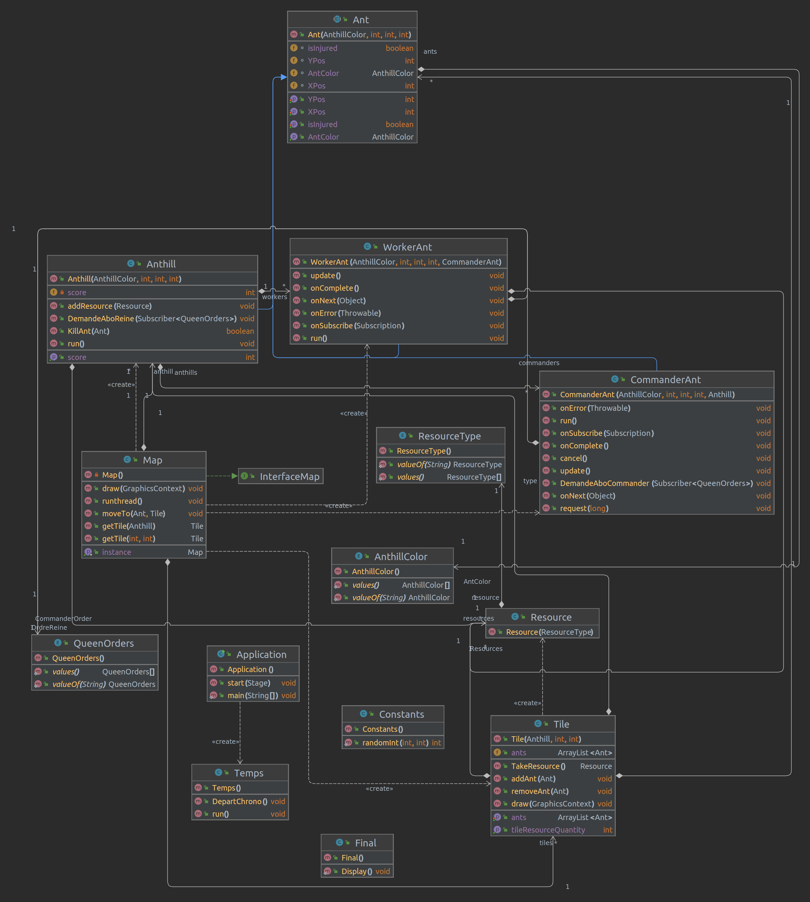

# Présentation
Le but de ce projet est de recréer l'activité de fourmiliere en un jeu.
ce jeu comportera une map divisé en carré avec des colonies de fourmis combatant pour récuperer le maximum de ressources.
Les fourmis bouge de case en case afin de chercher des ressources et les ramener a la fourmiliere.
Chaque carré de la map contiendra ou non des ressources.
il y aura 3 fourmilieres sur le terrain, la fourmiliere ayant le plus de points à la fin du nombre de tour sera vainqueur.
 

# Principe
Chaque carré de la carte contient un nombre aléatoire de ressource. 
Il y a 3 fourmillières sur la carte placé aléatoirement sur la map.
Les fourmillères sont placé aléatoirement. 
Il y a 3 types de fourmis:
1. la reine (1)
2. les commandants (5)
3. les ouvrières (50)
Les fourmis bougent de case en case (les déplacement sont Haut, Bas, Gauche et Droite) pour aller chercher des ressources, une fourmi ne peut transporter que 5 ressources et doit les ramener à la colonie avant de pouvoir en ramasser d'autre. A chaque fois que des ressources sont déposés dans la colonie son score augmente.
Une partie dure 2 min.

Dans chaque fourmillière il y a une reine, cette reine reste dans la fourmillière, elle peut donner des ordres:
- Aller chercher des ressources - GO_FIND_RESSOURCE
- Tout le monde rentre dans la fourmillière - GO_ANTHILL 
Mais elle ne connait aucune fourmi. Ce sont les commandant qui "écoutent" via Flow les ordres. Les commandant non plus ne connaissent pas les ouvrières, mais les fourmis ouvrières écoutent leur commandant, et applique les ordres.

Les commandants peuvent bouger sur la map, mais ils ne peuvent pas ramasser de ressource.

Chaque ouvrière est attribué à un commandant. (10 ouvrières pour 1 commandant)

Seul la reine connait la durée de la partie, elle doit donc donner l'ordre de rentrer à la fourmilière avant que la partie ne soit fini.

Avant la fin de la partie la reine emmet l'ordre de rentrer à la fourmiliere afin de déposer un maximum de ressources et ainsi éviter des pertes.

A la fin de la partie les threads sont stopé et une nouvelle fenetre apparait indiquant le vainquer et les scores de chaque équipes.

# Information

Ce jeu peut encore être améliorer avec l'ajout de certaine fonctionnalité tel que: 
- ajout de combat et de blessure 
- création de nouvelle fourmis et commandants
- phéromone pour améliorer les déplacements des fourmis
- ajout des images
- et autres idées

Attention ce code ne permet pas de lancer une map 500*500 il faudrait améliorer la création de la map

SDK 17 java version "17.0.2"

# UML

